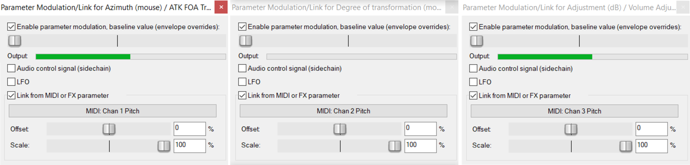

[Visualization of coordinate math](https://www.desmos.com/calculator/qzcw2goadz)

This project uses realtime location data to control audio effects plugins in order to simulate movement throughout a virtual soundscape.
Both a "map" of sounds in [-1, 1] coordinate space and the corner points of the listening space that the user sets are used to map out virtual sounds in real space. As the listener moves through the area they defined, each different audio source in the soundscape will move around the stereo field.

This program was originally written to be used with [gps2ip](http://www.capsicumdreams.com/gps2ip/), which transmits GPS coordinates in real time over TCP. The GPS data was unfortunately not nearly precise enough for the size of the listening area I tested out (about 10ft x 10ft). It may be accurate enough to map out sounds in a much larger space.

In place of real location data, I set up a graph acting as an X/Y controller which is used to simulate the listener's movement throughout the listening area.


### Requirements:
 - [loopMIDI](https://www.tobias-erichsen.de/software/loopmidi.html)
   used to create a virtual MIDI port need to send created MIDI messages to DAW. Another virtual MIDI program may also work.
 - [midicat](https://github.com/gomidi/midicat)
   used to send MIDI messages from Go. Midicat.exe must be placed in the same directory as loc2Midi.exe
 - [Reaper](http://reaper.fm/)
   used for sound playback and manipulation.
 - [ATK for Reaper](https://www.ambisonictoolkit.net/documentation/reaper/)
   used to control spatial characteristics of each audio track.

### To run:
 - Start loopMIDI on computer, create a new virtual MIDI port if necessary.
 - Modify config.json if necessary/desired.
   - Set MIDIPortName to the name of your created virtual port
   - Set audio track coordinates. Values should be in range [-1, 1]
 - Open reaper and set up each track's plugins and MIDI mappings.
   - Each track should have 4 audio channels and contain an ATK transform plugin, and two volume control plugins (the first controlling audio channels 1-2, the second controlling audio channels 3-4).
   - Messages are sent as MIDI pitch bend values, each track uses 3 channels. The first channel controls the azimuth (angle) of the sound, the second controls the degree of transformation (distance), and the third controls the volume. Set up the mappings as shown: <br><br> 
   
 - Run ```go run main.go``` or loc2Midi.exe. A browser window will open, containing a graph with a central point that you can use to control the listening location. For smoother movement, set the graph's step value to 0.

### Current limitations:
 - Only supports 5 tracks.
 - Changes to coordinates in config.json are not reflected in the graph controller.
 - Direction that the listener is facing does not change angle of the tracks.
 - Defined listening can only be rectangular.